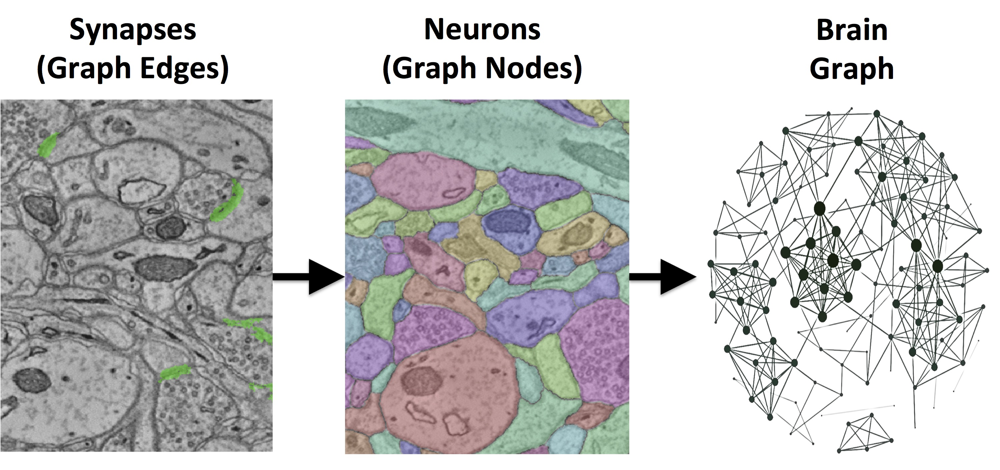

.. meta::
   :description: i2g:  An Automated Images-to-Graphs Framework for EM Connectomics
   :keywords: annotation, pipeline, connectomics, graph, neuroscience
.. title::
   i2g

.. raw:: html

   <h1>i2g:  An Automated Images-to-Graphs Framework for EM Connectomics</h1> 

i2g provides a fully-automated pipeline for estimating brain graphs from electron microscopy image volumes and assessing the results.  We evaluate a set of algorithms and parameters, searching possible operating points to identify the best available brain graph for our assessment metric.  All code and data derivatives have been made publicly available toward eventually unlocking new biofidelic computational primitives and understanding of neuropathologies.

.. raw:: html
 
  

    
    
     <a href="https://github.com/openconnectome/i2g/zipball/master"> [ZIP]   </a>  
    <a image="_static/GitHub.png" href="https://github.com/openconnectome/i2g/tarball/master">[TAR.GZ] </a>

  

.. sidebar:: i2g Contact Us 
   
   If you have questions about i2g, or have data to analyze, let us know:  ocp-support@googlegroups.com

.. toctree::
   :maxdepth: 1
   :caption: Documentation

   sphinx/introduction
   sphinx/local_config
   sphinx/ocp
   sphinx/faq

.. toctree::
   :maxdepth: 1
   :caption: Tutorials

   tutorials/basic_usage
   tutorials/advanced_usage
   tutorials/validation
   
.. toctree::
   :maxdepth: 1
   :caption: Paper

   paper/inputdata
   paper/outputdata 
   
.. toctree::
   :maxdepth: 1
   :caption: Further Reading

   api/functions
   api/modules
   Gitter chatroom <https://gitter.im/openconnectome/i2g>
   Mailing List <https://groups.google.com/forum/#!forum/ocp-support/> 
   Github repo <https://github.com/openconnectome/i2g>
   Release Notes <https://github.com/openconnectome/i2g/releases/>

If you use i2g or its data derivatives, please cite:
   William Gray Roncal, Dean M. Kleissas, Joshua T. Vogelstein, Priya Manavalan, Kunal Lillaney, Michael Pekala, Randal Burns, R. Jacob Vogelstein, Carey E. Priebe, Mark A. Chevillet, Gregory D. Hager. An Automated Images-to-Graphs Framework for High Resolution Connectomics. In Review, 2015 `arXiv <http://arxiv.org/abs/1411.6880>`_ 

  